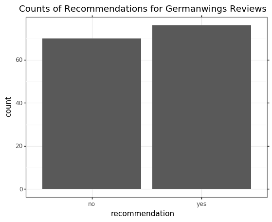
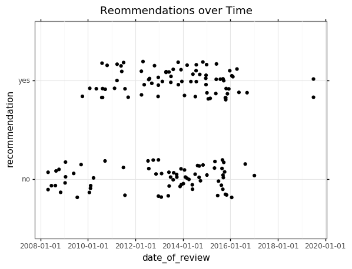
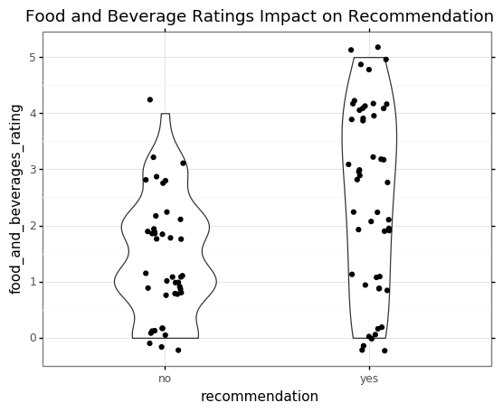
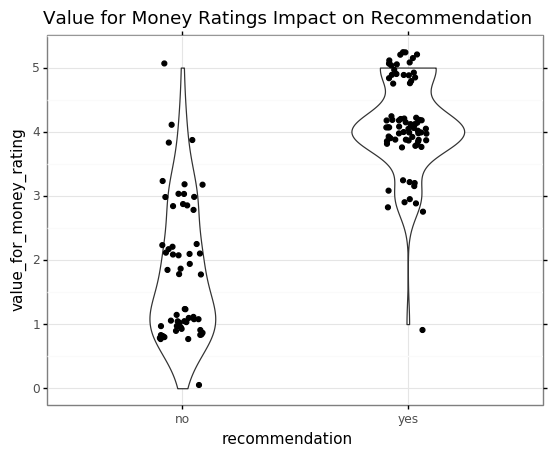

# Germanwings Review Analysis Report
#### Evan Yathon

### Overview

Germanwings is [a low-cost airline owned by Lufthansa, operating under the Eurowings brand](https://en.wikipedia.org/wiki/Germanwings).  Customers sometimes review the flight service on a website such as [airlinequality.com](airlinequality.com).  This analysis will focus on several reviews from this website.

In each review there is a final recommendation, either recommending Germanwings or not.  These reviews can be very important for a company, as in the age of online reviews much of our decision making can be swayed by online opinion.  It would be valuable to see what factors influence a recommendation.  

My goal for this project is to attempt to see which features are important and what their influence is on a customers recommendation.

### Scraping

When looking at the [original data](data/given_4U_reviews.txt) I noticed that the categories such as 'seat comfort' or 'ground service' were populated with only the value `12345`.  I searched some of the customer reviews and found that the data had come from [www.airlinequality.com](www.airlinequality.com), and saw that these categories should have a star rating out of 5.  I decided that I would likely have a more comprehensive dataset to play with if these categories were correctly filled, and thus decided to scrape the website for Germanwings reviews.

While the script is built specifically for Germanwings, it could easily be extended to any other airline on the same website with a few tweaks.  If I had more time I would modify it to be modular, but in the interest of time kept it specific to this task.

Note that sleep time is the time to wait between traversal of each page, in order to be polite to the website and not overload it with requests.

The scraping script has the following highlights:

- Status error check to ensure the connection has been properly created
- HTML parsing via `BeautifulSoup`
- Parsing of an unknown number of review pages
- Easily converted to be modular for other review pages on `airlinequality.com`
- Stores data in a `pandas` dataframe for easy access/manipulation
- Several HTML tag extraction functions to access specific elements

The scraping script results in a useful, up to date `pandas` Dataframe with many scraped features from the site.

### Clean and Verify

Clean and Verify performs some basic data cleaning, parsing and verification.  The verification ensures that reviews from the original dataset are all present in the newly scraped dataset.

All original reviews ended up being in the newly scraped dataset, although 7 were mismatched likely to some hidden formatting issue.  These 7 were manually verified.

Several columns in the scraped reviews were missing large portions of data due to customers simply not filling in every field for their review.  One such column was date flown.  A visualization was created to analyze how close the date of the review was to the date flown; it turned out that 80% of reviews are posted within 50 days of the flight.  In case it ever came up, I could be reasonably certain that review date could sub in for date flown if needed.

Some columns required additional parsing to extract wanted values.  One such column was reviewer country, which grabbed the reviewer name, country, and date of review.  Fortunately each item had a similar pattern able to be exploited via regex.  Dates were extracted using this pattern.

The route column was also flagged for additional parsing, but was not undertaken at this time.  My reasoning for this was that the column had ~80% of its data missing, so would likely not be useful in the final analysis due to low sample size.

### EDA

The purpose of the EDA notebook is to explore the previously cleaned data. This is done mainly through plots in order to get an idea of what to expect and any pitfalls that may be anticipated.

One of the first things I did was check to see if there was an imbalance in the planned response variable.  If there was an imbalance then additional steps in regression would have to be taken.  Fortunately there was not an imbalance as seen below.

Several other plots were created an explored, I will highlight a couple below.

A plot of review value out of 10 over time is shown below.

This plot led to the discovery that Germanwings changed to Eurowings in 2016, which in turn led to the decision to remove all reviews after the company change.  It also opened up another avenue of questioning for the period between 2011 and 2013 where there seemed to be a lot more positive reviews compared to negative reviews.  Further exploring this seemed like an alternative project.

A jitter plot with underlain violin plot is shown below of food and beverage ratings with recommendation.

There is quite of a bit of overlap for similar ratings in both yes and no recommendations.  It seems that food and beverage ratings aren't that important to people when deciding whether or not to recommend an airline.  

On the contrary, value for money ratings seem to be much more important.

People who had high ratings for value for money seemed to be much more likely to recommend the airline, indicating a potentially more important area to focus on.

### Topic Modeling

The purpose of this notebook is to process the review title and content to extract key topics in each review. Then key topics will be used in a regression analysis to find out what is most important for a reviewer in recommending or not recommending the airline.

Topic modeling will use LDA to extract topics. Probability of belonging to a certain topic were implemented as new features and used in the regression analysis.

Topic modeling was chosen to try to infer common topics and themes between reviews.  If reviews were talking about the same thing consistently, then perhaps these topics were important one way or another to their recommendation.

Separate topic modeling analyses were used for review title and text with the idea that titles are often an important summary of the reviewers main point.  Also could have combined both title and review text to have a larger corpus to learn from, which was also considered.

Preprocessing is crucial for topic modeling, and `spacy` was the chosen library for preprocessing.  Stopwords and unwanted parts of speech were removed.  Words were reduced to their lemma, and specific parts of the text were removed via regex.

After preprocessing a dictionary and document-term matrix were created and used to train an LDA (Latent Dirichlet Allocation) model.  Several values of `alpha` and `eta` were experimented with to result in topics made up of words that were similar and made sense.  In addition, the visualization created by the `pyLDAvis` library was used to guide the number of topics selected.

Finally each review was given several new features which were the probability of belonging to the topics selected by the LDA algorithm.  I thought that having probabilities of topic assignment as compared to complete topic assignment might be better for the regression, to allow for uncertain topic assignment.

### Logistic Regression Analysis

In keeping with the main goal, regression would hopefully quantify these review features association with recommendation status.  Feature importance, coefficient estimates and confidence intervals are pulled from models after some initial cleanup is performed.

Several features are removed from the dataset as outlined in the notebook due to missing values or columns inappropriate for this regression.

Two scripts that I had previously coded, `PrepareForModel` and `bootstrap_skmodel` were used in this analysis.  `PrepareForModel` is a handy function to dummy encode categorical variables.  `bootstrap_skmodel` outputs bootstrapped coefficients for a `scikit-learn` model in order to obtain confidence intervals.

Feature importance was obtained by using L1 regularization with varying regularization strengths.  L1 regularization tends to zero out less important feature coefficients with increasing regularization strength, so the order that the coefficients were zeroed out indicates the relative importance.

Important features in order were found to be:

1. Review value out of 10
2. Value for money rating out of 5
3. Money value topic obtained from review titles
4. Food, beverages and crew topic obtained from review text
5. Luggage and seats topic obtained from review text
6. Staff and delays topic obtained from review titles
7. Time and delays topic obtained from review text
8. First Class seating type
9. Business Class seating type

Note that the seating types for first and business class only had one sample for each, the rest were economy class.

Logistic Regression Coefficients were obtained along with bootstrapped coefficients, but as hypothesized earlier they were not very reliable.  The low sample size impacted them greatly, resulting in unstable estimates from bootstrapping.  Another possible cause may have been multicollinearity, causing unstable estimates.

### Conclusion

Unfortunately the association effect of each feature wasn't able to be reliably obtained through logistic regression, but the feature importance list seemed to be useful.  It lined up with what was seen in the EDA section.

I would say that some of the most important factors for customers recommending Germanwings were:

1. Value for money
2. Crew service
3. Seat comfort

Whereas some of the least important factors were:

1. Inflight food and beverages
2. Inflight entertainment

I was surprised to not see time and delays be higher on the list for recommendations, although the small sample size may have again sabotaged this.

### Future Steps and Alternative Ideas

Some future steps given more time:
- Investigate multicollinearity and perhaps use `statsmodels` rather than `scikit-learn` to get CLT estimates of coefficients
- Play around with different types of imputation for missing values
- Further refine LDA, or try some other type of NLP
  * Common n-grams to extract phrases
- Obtain secondary feature importance with tree based methods

Alternative Ideas:
- [Eurowings](https://www.airlinequality.com/airline-reviews/eurowings) has several reviews.  Maybe a separate project to identify if the transfer of holdings had a positive impact
- Expand this analysis to all airlines on airlinequality.com; what are the most important things to people when they fly?
